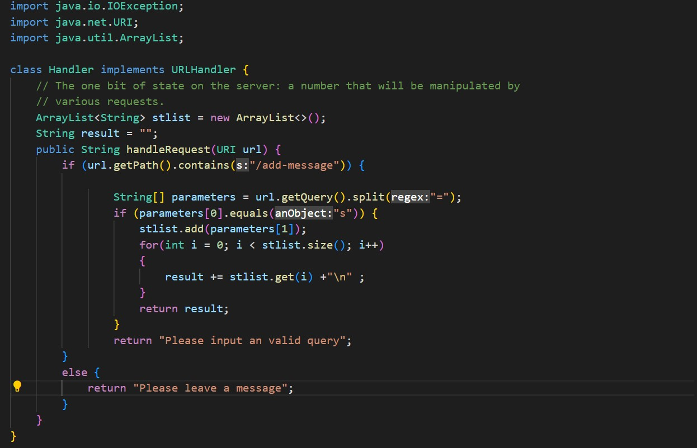
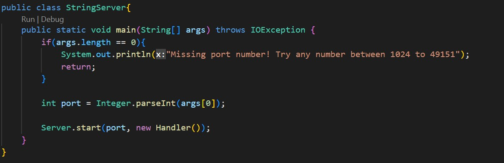
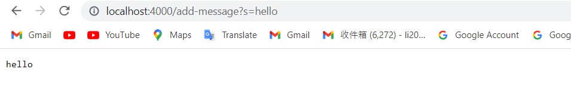
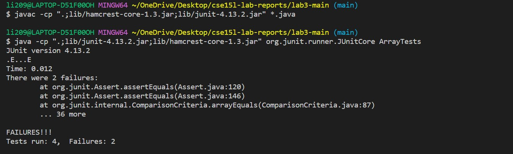
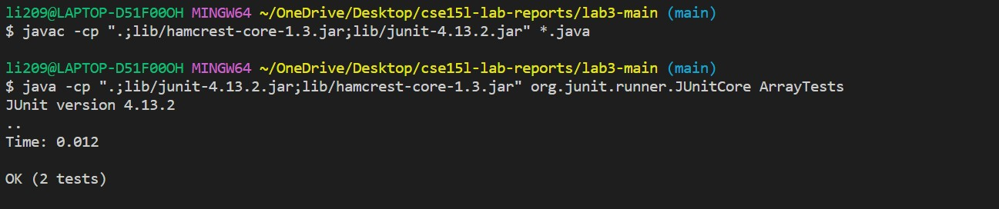

# CSE15LabReport2

Part1
=====

**StringServer(URL Handler and Server)** 





**Calling add on server**
Simply change the url and add `/add-message?s=note` change note to your custom message



The method handleRequest from class URLHandler were called by the main method in StringServer. The relevent argument was the URL input to handleRequest method.
The url request was analyzed and the query message stored in field stList. The message "hello" was added to field result.
The field stList chaned from an empty arrayList to an arrayList with a single element. The field result changed from an empty array to "hello".

.jpg)

The method handleRequest from class URLHandler were called by the main method in StringServer. The relevent argument was the URL input to handleRequest method.
The url request was analyzed and the query message stored in field stList. The message "Welcome to Francis' Server" was added to field result.
The field stList chaned from an empty arrayList to an arrayList with a single element. The field result changed from an empty array to "hello\nWelcome to Francis' Server".

Part2
=====

````
@Test
  public void testReverseInPlace2()
  {
    int[] input = { 3, 6, 9 , 12 };
    ArrayExamples.reverseInPlace(input);
    assertArrayEquals(new int[]{ 12,9, 6, 3 }, input);
  }
  ````
  This input for method reverseInPlace result in a wrong output.
  ````
@Test
  public void testReverseInPlace2()
  {
    int[] input = { };
    ArrayExamples.reverseInPlace(input);
    assertArrayEquals(new int[]{0}, input);
  }
  ````
  This input for method reverseInPlace produce the correct output.
  
  
  
  This is the terminal output for the first input which produce an incorrect output.
  
  
  
  This is the terminal output for the second input which produce an correct output.
  
  The program's symptom is that it produce incorrect output. However, the program worked smoothly for an empty array input.
  
  **Before**
  ````
  static void reverseInPlace(int[] arr) {
    for(int i = 0; i < arr.length; i += 1) {
      arr[i] = arr[arr.length - i - 1];
    }
  }
  ````
  **After**
  ````
  static void reverseInPlace(int[] arr) {
    int temp;
    for(int i = 0; i < arr.length/2; i += 1) {
      temp = arr[i];
      arr[i] = arr[arr.length - i - 1];
      arr[arr.length - i - 1] = temp;
    }
  }
  ````
  The original code did not complete the swap. The program only replaced the first half with second half. 
  The for loop in the original method starting at index 0, the first element is replaced by the last element. 
  The element at index 0 is lost after the swap. Same procudure error resulting data lost in the first half of the array. 
  The update fix to the program complete the swap by adding a temperary varaible to store data.
  In this way, the method replace the first element with last and last with first. 
  Because we are replacing two elements at the same time, the for loop only need to run til the mid-point of the array.
  Then a complete position swap is performed to each element in the array. 
  
  Part3
  =====
  
  I learned more git command in these two labs. Github desktop was also introduced to me as a useful tool. I didn't know that the files on Github website is stored    locally on my computer. The labs encouraged me to organize files on my computer. 
