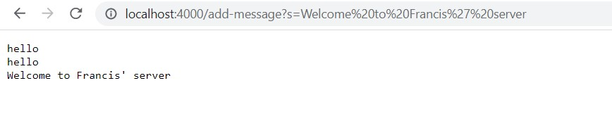

# CSE15LabReport2
Part1
======
**StringServer(URL Handler and Server)** 


**Calling add on server**
Simply change the url and add `/add-message?s=note` change note to your custom message


The method handleRequest from class URLHandler were called by the main method in StringServer. The relevent argument was the URL input to handleRequest method.
The url request was analyzed and the query message stored in field stList. The message "hello" was added to field result.
The field stList chaned from an empty arrayList to an arrayList with a single element. The field result changed from an empty array to "hello".



The method handleRequest from class URLHandler were called by the main method in StringServer. The relevent argument was the URL input to handleRequest method.
The url request was analyzed and the query message stored in field stList. The message "Welcome to Francis' Server" was added to field result.
The field stList chaned from an empty arrayList to an arrayList with a single element. The field result changed from an empty array to "hello\nWelcome to Francis' Server".

Part2
======

````
@Test
  public void testReverseInPlace2()
  {
    int[] input = { 3, 6, 9 , 12 };
    ArrayExamples.reverseInPlace(input);
    assertArrayEquals(new int[]{ 12,9, 6, 3 }, input);
  }
  ````
  This input for method reverseInPlace result in a wrong output.
  ````
@Test
  public void testReverseInPlace2()
  {
    int[] input = { };
    ArrayExamples.reverseInPlace(input);
    assertArrayEquals(new int[]{0}, input);
  }
  ````
  This input for method reverseInPlace produce the correct output.
